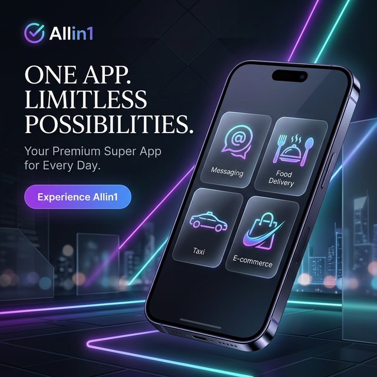

# 🌐 Allin1 Super App - White-Label SaaS Platform

**Allin1** is a high-performance, modular **Flutter-based Super App** template designed for rapid deployment of local 
ecosystems. Inspired by the "everything app" model (WeChat, Grab, Gojek), Allin1 provides a unified platform for messaging, 
Uber-style riding, logistics, and multi-vendor hyper-local e-commerce.

---

## 🚀 Vision: The White-Label Advantage
This repository is NOT just a clone-and-run app. It is a **SaaS Template** for entrepreneurs and developers to build their own local 
super apps. 

*   **Modular Architecture**: Every service (Taxi, Food, Grocery) is a self-contained module.
*   **Hyper-Local Focus**: Optimized for 30-minute delivery using a unified bike taxi rider fleet.
*   **Privacy-First Social**: Built-in messaging inspired by Telegram's username and privacy system.

---

## 🛠 Features Overview

### 💬 Messenger (The Hub)
*   **Telegram-Style**: Real-time chat with unique usernames.
*   **Secure**: Peer-to-peer and group messaging.
*   **Discovery**: Geolocation-based matching ("People Nearby") for social and dating.

### 🚕 Unified Logistics & Taxi
*   **Bike Taxi & Auto**: Uber-like ride hailing for passengers.
*   **Mini-Trucks**: Logistics for heavy goods and moving services.
*   **Dual-Role Fleet**: Riders can switch between taking passengers and delivering goods.

### 🛍 Hyper-Local E-Commerce
*   **Multi-Vendor Support**: Grocery, Medical, Electronics, and Food.
*   **Instant Delivery**: Integrated 30-minute delivery via the on-platform rider fleet.
*   **Store Dashboard**: Professional interface for shop owners.

---

## 🏗 Modular Implementation Workflow
1.  **Research-Driven**: We deeply search the web for the best Flutter open-source implementations.
2.  **Code Synthesis**: Instead of manual cloning, we analyze and integrate code from top GitHub sources (e.g., Telegram-clones, Lalamove-clones) into the modular Allin1 core.
3.  **Unified Fleet Management**: Designing a shared gig-worker app where riders serve all modules.

---

## 🤝 Contribution
Contributions are welcome! If you have optimized code for a specific module or want to improve the core infrastructure, please feel free 
to submit a PR.

### How to Contribute:
1.  Fork the repository.
2.  Create a feature branch (`git checkout -b feature/AmazingFeature`).
3.  Commit your changes following the [Conventional Commits](https://www.conventionalcommits.org/) spec.
4.  Push to the branch.
5.  Open a Pull Request.

---

## 📜 License
Internal use for NJ-AI-web. For open-source distribution, see [LICENSE](LICENSE).

---
*Maintained with ❤️ by **Antigravity Google Deepmind***

---

## Role-Based Entry Points

Web entry points by role:

1. `/#/` ? Landing page
2. `/#/login` ? Customer login
3. `/#/seller` ? Seller login
4. `/#/rider` ? Rider login
5. `/#/admin` ? Admin login

Post-login panels:

1. `/#/seller-portal` ? Seller dashboard
2. `/#/rider-portal` ? Rider dashboard
3. `/#/admin-panel` ? Admin dashboard
