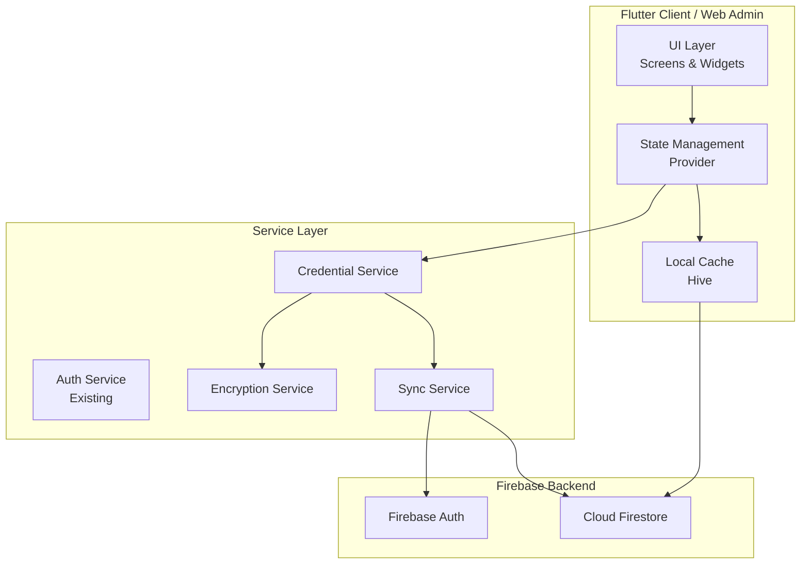
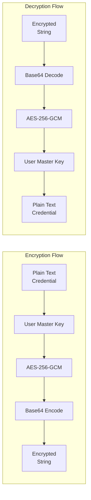
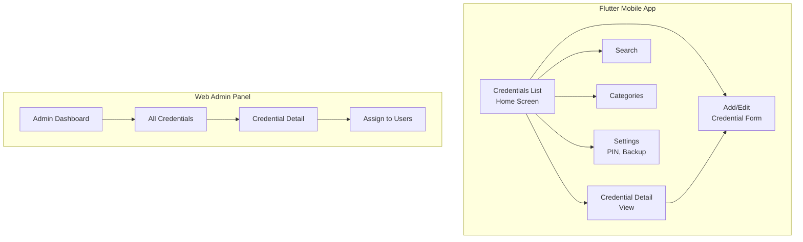
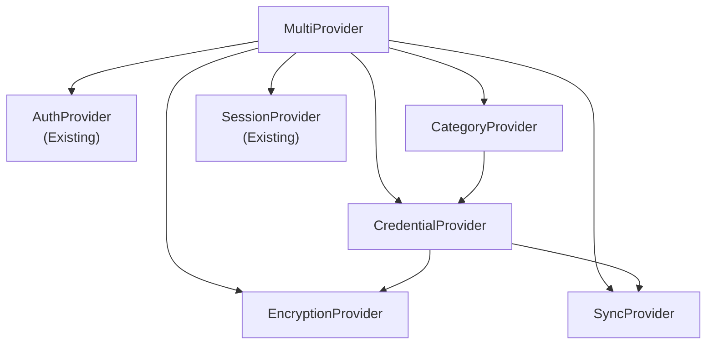
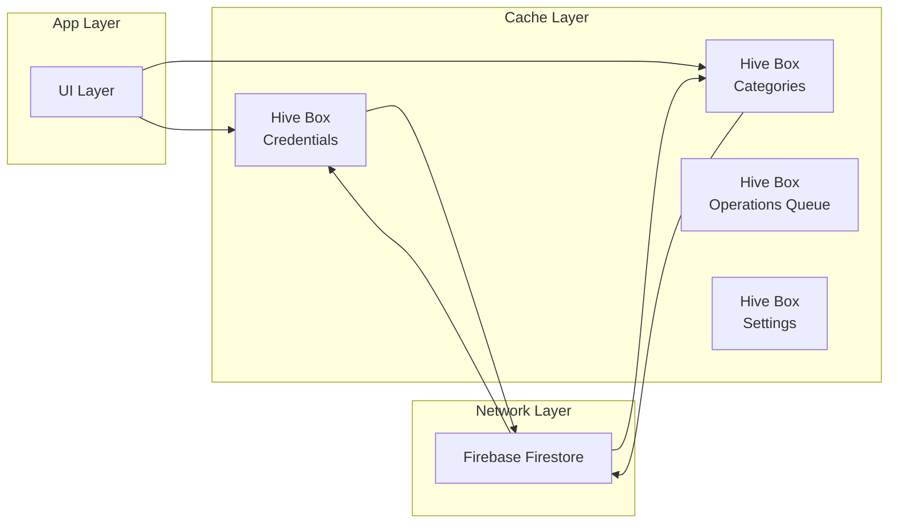

# Credential Management System - Technical Design Document

## Overview

A secure credential management system for the Allin1 Super App that enables users to store and manage sensitive credentials (passwords, API keys, secure notes, bank details) with Firebase backend, real-time synchronization, and offline support.

**Project:** Allin1 Super App (Flutter)  
**Backend:** Firebase Cloud Firestore + Authentication  
**State Management:** Provider  
**Local Storage:** Hive (existing dependency)  
**Encryption:** AES-256 application-level encryption  

---

## 1. System Architecture

### 1.1 High-Level Architecture



### 1.2 Component Responsibilities

| Component | Responsibility |
|-----------|---------------|
| **UI Layer** | Display credentials, forms, manage user interactions |
| **Provider** | Manage state, expose data to UI, handle business logic |
| **CredentialService** | CRUD operations, data validation, Firestore communication |
| **EncryptionService** | AES-256 encryption/decryption of sensitive data |
| **SyncService** | Real-time synchronization, offline queue management |
| **Hive Cache** | Local storage for offline access and caching |

---

## 2. Data Model

### 2.1 Credential Model

```dart
enum CredentialType {
  password,      // Website/app passwords
  apiKey,        // API keys and tokens
  secureNote,   // Encrypted text notes
  bankAccount,  // Bank account details
  wifi,         // WiFi credentials
  card,         // Credit/debit card details
  other,        // Other credential types
}

class Credential {
  final String id;
  final String userId;           // Owner user ID
  final String title;            // Display name (not encrypted)
  final CredentialType type;
  
  // Encrypted fields
  final String encryptedUsername;
  final String encryptedPassword;
  final String? encryptedUrl;
  final String? encryptedNotes;
  final String? encryptedExtra; // Additional field (card number, etc.)
  
  // Metadata (not encrypted)
  final String? category;        // User-defined category
  final bool isFavorite;
  final bool isPinned;
  final DateTime createdAt;
  final DateTime updatedAt;
  final DateTime? lastAccessedAt;
  
  // Access control
  final List<String> sharedWith; // User IDs who can view
  final bool isAdminManaged;     // Admin-created credential
  
  // Sync metadata
  final bool isSynced;
  final bool isDeleted;          // Soft delete flag
}
```

### 2.2 Credential Category Model

```dart
class CredentialCategory {
  final String id;
  final String userId;
  final String name;
  final String? icon;           // Icon name
  final String? color;          // Hex color
  final int sortOrder;
  final DateTime createdAt;
}
```

### 2.3 User Credential Access Model

```dart
class UserCredentialAccess {
  final String id;
  final String odId;            // Owner user ID
  final String accessorId;      // User who can access
  final String credentialId;
  final AccessLevel accessLevel; // read, write, admin
  final DateTime grantedAt;
  final String? grantedBy;
}

enum AccessLevel { read, write, admin }
```

---

## 3. Firebase Firestore Collection Structure

### 3.1 Collections Overview

```
credentials/
  {credentialId}/
    - id: string
    - userId: string (indexed)
    - title: string
    - type: string (password|apiKey|secureNote|bankAccount|wifi|card|other)
    - encryptedUsername: string
    - encryptedPassword: string
    - encryptedUrl: string?
    - encryptedNotes: string?
    - encryptedExtra: string?
    - category: string?
    - isFavorite: boolean
    - isPinned: boolean
    - createdAt: timestamp
    - updatedAt: timestamp
    - lastAccessedAt: timestamp?
    - sharedWith: array<string>
    - isAdminManaged: boolean
    - isSynced: boolean
    - isDeleted: boolean
    - _checksum: string (hash for integrity)

credentialCategories/
  {categoryId}/
    - id: string
    - userId: string (indexed)
    - name: string
    - icon: string?
    - color: string?
    - sortOrder: integer
    - createdAt: timestamp

credentialAccess/
  {accessId}/
    - id: string
    - ownerId: string (indexed)
    - accessorId: string (indexed)
    - credentialId: string (indexed)
    - accessLevel: string (read|write|admin)
    - grantedAt: timestamp
    - grantedBy: string?

adminCredentials/
  {adminId}/
    // Admin-managed credentials (visible to specific users)
    - id: string
    - title: string
    - type: string
    - encryptedData: map
    - assignedUserIds: array<string>
    - createdBy: string (admin ID)
    - createdAt: timestamp
    - updatedAt: timestamp
```

### 3.2 Indexes Required

```javascript
// firestore.indexes.json
{
  "indexes": [
    {
      "collectionGroup": "credentials",
      "queryScope": "COLLECTION",
      "fields": [
        { "fieldPath": "userId", "order": "ASC" },
        { "fieldPath": "isDeleted", "order": "ASC" }
      ]
    },
    {
      "collectionGroup": "credentials",
      "queryScope": "COLLECTION",
      "fields": [
        { "fieldPath": "userId", "order": "ASC" },
        { "fieldPath": "type", "order": "ASC" }
      ]
    },
    {
      "collectionGroup": "credentialAccess",
      "queryScope": "COLLECTION",
      "fields": [
        { "fieldPath": "accessorId", "order": "ASC" }
      ]
    }
  ]
}
```

---

## 4. Encryption Strategy

### 4.1 Encryption Architecture



### 4.2 Key Management

```dart
class EncryptionService {
  // Master key derived from user's PIN/password
  // Stored securely using flutter_secure_storage (Android Keystore / iOS Keychain)
  
  // Key derivation: PBKDF2 with 100,000 iterations
  // Salt: Unique per user, stored in Firestore
  
  // Encryption: AES-256-GCM (provides authenticated encryption)
  // IV: Random 12 bytes per encryption, prepended to ciphertext
  
  // Storage format: base64(IV + ciphertext + authTag)
}
```

### 4.3 Encryption Implementation

```dart
// Required packages to add:
// encrypt: ^5.0.3
// flutter_secure_storage: ^9.2.2
// pointycastle: ^3.9.1

class EncryptionKeys {
  String masterKey;           // Derived from user's PIN
  String salt;                // User's unique salt
  String? deviceKey;         // Device-specific key for backup
}

// Encryption flow:
// 1. Generate random IV (12 bytes)
// 2. Encrypt using AES-256-GCM
// 3. Prepend IV to ciphertext
// 4. Base64 encode for Firestore storage
```

### 4.4 Data Integrity

- **Checksum**: SHA-256 hash of decrypted data stored alongside
- **Versioning**: Credential version number for migration support

---

## 5. Security Rules Specification

### 5.1 Firestore Security Rules

```javascript
rules_version = '2';
service cloud.firestore {
  match /databases/{database}/documents {
    
    // Helper functions
    function isAuthenticated() {
      return request.auth != null;
    }
    
    function isOwner(userId) {
      return isAuthenticated() && request.auth.uid == userId;
    }
    
    function isAdmin() {
      return isAuthenticated() && 
        get(/databases/$(database)/documents/users/$(request.auth.uid)).data.userType == 2;
    }
    
    // ========== USER CREDENTIALS ==========
    match /credentials/{credentialId} {
      // Users can read their own credentials
      allow read: if isOwner(resource.data.userId) 
        || resource.data.sharedWith.hasAny([request.auth.uid]);
      
      // Users can create their own credentials
      allow create: if isOwner(request.resource.data.userId)
        && request.resource.data.userId == request.auth.uid
        && validateCredentialFields(request.resource.data);
      
      // Users can update their own credentials
      allow update: if isOwner(resource.data.userId)
        && request.resource.data.userId == resource.data.userId
        && validateCredentialFields(request.resource.data);
      
      // Users can soft-delete their own credentials
      allow delete: if isOwner(resource.data.userId);
    }
    
    // ========== CREDENTIAL CATEGORIES ==========
    match /credentialCategories/{categoryId} {
      allow read: if isAuthenticated();
      allow write: if isOwner(resource.data.userId) 
        || (request.resource.data.userId == request.auth.uid);
    }
    
    // ========== CREDENTIAL ACCESS ==========
    match /credentialAccess/{accessId} {
      // Owner can manage access
      allow read, write: if isOwner(resource.data.ownerId);
      
      // Read access for accessor
      allow read: if isAuthenticated() && resource.data.accessorId == request.auth.uid;
    }
    
    // ========== ADMIN CREDENTIALS ==========
    match /adminCredentials/{credentialId} {
      // Only admins can read/write admin credentials
      allow read, write: if isAdmin();
      
      // Assigned users can read
      allow read: if isAuthenticated() 
        && resource.data.assignedUserIds.hasAny([request.auth.uid]);
    }
  }
  
  // Validation function
  function validateCredentialFields(data) {
    return data.title is string
      && data.title.size() > 0
      && data.title.size() <= 100
      && data.type in ['password', 'apiKey', 'secureNote', 'bankAccount', 'wifi', 'card', 'other']
      && data.encryptedUsername is string
      && data.encryptedPassword is string
      && (data.isDeleted == false || data.isDeleted == true)
      && (data.isFavorite == false || data.isFavorite == true);
  }
}
```

### 5.2 Security Rules Summary

| Operation | User (Owner) | User (Shared) | Admin | Public |
|-----------|--------------|---------------|-------|--------|
| Read own credentials | ✓ | - | ✓ | - |
| Read shared credentials | - | ✓ | ✓ | - |
| Read admin-assigned credentials | - | ✓ | ✓ | - |
| Create credentials | ✓ | - | ✓ | - |
| Update own credentials | ✓ | - | ✓ | - |
| Delete (soft) own credentials | ✓ | - | ✓ | - |
| Manage categories | ✓ | - | ✓ | - |
| Grant access to others | ✓ | - | ✓ | - |

---

## 6. Service Layer Architecture

### 6.1 Credential Service

```dart
class CredentialService {
  // Singleton pattern
  static final CredentialService _instance = CredentialService._internal();
  factory CredentialService() => _instance;
  
  final FirebaseFirestore _firestore = FirebaseFirestore.instance;
  final EncryptionService _encryption = EncryptionService();
  final SyncService _syncService = SyncService();
  
  // ========== CRUD Operations ==========
  
  /// Create new credential
  Future<CredentialResult> createCredential({
    required String title,
    required CredentialType type,
    required String username,
    required String password,
    String? url,
    String? notes,
    String? extra,
    String? category,
  });
  
  /// Get all credentials for current user
  Stream<List<Credential>> watchCredentials();
  
  /// Get single credential by ID
  Future<Credential?> getCredential(String id);
  
  /// Update credential
  Future<CredentialResult> updateCredential(Credential credential);
  
  /// Soft delete credential
  Future<CredentialResult> deleteCredential(String id);
  
  /// Permanent delete (admin only)
  Future<CredentialResult> permanentlyDelete(String id);
  
  /// Search credentials
  Future<List<Credential>> searchCredentials(String query);
  
  /// Get credentials by type
  Future<List<Credential>> getCredentialsByType(CredentialType type);
  
  /// Toggle favorite
  Future<void> toggleFavorite(String id);
  
  /// Toggle pin
  Future<void> togglePin(String id);
  
  // ========== Sharing ==========
  
  /// Share credential with another user
  Future<void> shareCredential(String credentialId, String userId, AccessLevel level);
  
  /// Revoke access
  Future<void> revokeAccess(String credentialId, String userId);
  
  // ========== Categories ==========
  
  /// Create category
  Future<void> createCategory(CredentialCategory category);
  
  /// Get categories
  Stream<List<CredentialCategory>> watchCategories();
  
  /// Update category
  Future<void> updateCategory(CredentialCategory category);
  
  /// Delete category
  Future<void> deleteCategory(String id);
}
```

### 6.2 Encryption Service

```dart
class EncryptionService {
  // Singleton
  static final EncryptionService _instance = EncryptionService._internal();
  factory EncryptionService() => _instance;
  
  // ========== Key Management ==========
  
  /// Initialize with user's master key (derived from PIN)
  Future<void> initializeWithMasterKey(String masterKey);
  
  /// Generate new master key
  String generateMasterKey();
  
  /// Derive key from PIN using PBKDF2
  String deriveKey(String pin, String salt);
  
  /// Check if encryption is initialized
  bool get isInitialized;
  
  /// Clear keys from memory
  Future<void> clearKeys();
  
  // ========== Encryption/Decryption ==========
  
  /// Encrypt a single field
  String encrypt(String plainText);
  
  /// Decrypt a single field
  String decrypt(String encryptedText);
  
  /// Encrypt credential data map
  Map<String, String> encryptCredentialData(CredentialData data);
  
  /// Decrypt credential data map
  CredentialData decryptCredentialData(Map<String, String> encrypted);
  
  // ========== Integrity ==========
  
  /// Generate checksum for data integrity
  String generateChecksum(String data);
  
  /// Verify checksum
  bool verifyChecksum(String data, String checksum);
}
```

### 6.3 Sync Service

```dart
class SyncService {
  // Singleton
  static final SyncService _instance = SyncService._internal();
  factory SyncService() => _instance;
  
  final FirebaseFirestore _firestore = FirebaseFirestore.instance;
  
  // ========== Real-time Sync ==========
  
  /// Watch credential changes in real-time
  Stream<List<Credential>> watchCredentials(String userId);
  
  /// Watch single credential
  Stream<Credential?> watchCredential(String credentialId);
  
  // ========== Offline Support ==========
  
  /// Check if online
  bool get isOnline;
  
  /// Queue pending operations for offline
  Future<void> queueOperation(SyncOperation operation);
  
  /// Process queued operations when online
  Future<void> processQueue();
  
  /// Get cached credentials
  Future<List<Credential>> getCachedCredentials();
  
  /// Cache credentials locally
  Future<void> cacheCredentials(List<Credential> credentials);
  
  /// Clear cache
  Future<void> clearCache();
  
  // ========== Conflict Resolution ==========
  
  /// Resolve sync conflicts
  SyncResolution resolveConflict(localData, remoteData);
}

enum SyncOperationType { create, update, delete }

class SyncOperation {
  final SyncOperationType type;
  final String collection;
  final String documentId;
  final Map<String, dynamic> data;
  final DateTime timestamp;
}
```

---

## 7. Screen/UI Architecture

### 7.1 Mobile App Screens

```
lib/screens/
├── credentials/
│   ├── credentials_list_screen.dart    # Main credential list
│   ├── credential_detail_screen.dart   # View credential details
│   ├── credential_form_screen.dart     # Add/Edit credential
│   ├── credential_search_screen.dart   # Search credentials
│   ├── credential_categories_screen.dart
│   └── credential_settings_screen.dart # PIN, backup, etc.
├── admin/
│   ├── admin_credentials_screen.dart   # Manage all credentials
│   ├── admin_credential_detail_screen.dart
│   └── admin_assign_credential_screen.dart
```

### 7.2 Screen Flow



### 7.3 UI Components

```dart
// Reusable Widgets
lib/widgets/
├── credentials/
│   ├── credential_card.dart           # List item card
│   ├── credential_type_icon.dart      # Type-specific icon
│   ├── password_strength_indicator.dart
│   ├── credential_field.dart         # Encrypted field display
│   ├── category_chip.dart
│   └── share_indicator.dart
├── forms/
│   ├── credential_form.dart
│   ├── secure_text_field.dart        # Masked input
│   └── category_selector.dart
└── common/
    ├── loading_overlay.dart
    ├── empty_state.dart
    └── error_view.dart
```

### 7.4 Mobile Screen Specifications

#### Credentials List Screen
- **Header**: AppBar with title, search icon, add button
- **Filter Chips**: Horizontal scroll for type filters (All, Passwords, API Keys, etc.)
- **List**: Lazy-loaded ListView with credential cards
- **Sorting**: Pinned first, then favorites, then alphabetical
- **FAB**: Add new credential
- **Empty State**: Illustration + "Add your first credential" CTA

#### Credential Detail Screen
- **Header**: Title, favorite toggle, edit button, delete button
- **Fields**: Username, Password (masked, tap to reveal), URL, Notes
- **Password Field**: Copy button, show/hide toggle
- **Metadata**: Category, created date, last accessed
- **Sharing**: If shared, show share indicator with accessors
- **Admin Badge**: If admin-managed, show badge

#### Add/Edit Credential Form
- **Fields**:
  - Title (required, max 100 chars)
  - Type selector (dropdown)
  - Username (required for password/type)
  - Password (required, with generator)
  - URL (optional)
  - Notes (optional, multiline)
  - Category (optional, dropdown)
- **Password Generator**:
  - Length slider (8-64)
  - Toggle: uppercase, lowercase, numbers, symbols
  - Generate button
- **Validation**: Real-time validation with error messages

### 7.5 Web Admin Panel Screens

#### Admin Credentials Screen
- **Layout**: Data table with columns (Title, Type, Owner, Category, Shared, Created, Actions)
- **Features**: Search, filter by type, sort, bulk actions
- **Actions**: View, Edit, Delete, Assign to users
- **Stats**: Total credentials, by type, sharing stats

#### Admin Assign Credential Screen
- **Credential Selector**: Search and select credential
- **User Selector**: Search and select users to assign
- **Preview**: Show credential details (admin can view)
- **Confirmation**: Summary before assignment

---

## 8. State Management Approach

### 8.1 Provider Architecture

```dart
// ========== Providers ==========

// Main credential provider
class CredentialProvider extends ChangeNotifier {
  List<Credential> _credentials = [];
  List<CredentialCategory> _categories = [];
  bool _isLoading = false;
  String? _error;
  
  // Getters
  List<Credential> get credentials => _credentials;
  List<Credential> get pinnedCredentials => ...
  List<Credential> get favoriteCredentials => ...
  List<Credential> getCredentialsByType(CredentialType type) => ...
  bool get isLoading => _isLoading;
  String? get error => _error;
  
  // Actions
  Future<void> loadCredentials();
  Future<void> createCredential(...);
  Future<void> updateCredential(...);
  Future<void> deleteCredential(...);
  Future<void> searchCredentials(String query);
  
  // Real-time subscription
  void subscribeToCredentials();
}

// Category provider
class CategoryProvider extends ChangeNotifier {
  // Similar structure
}

// Encryption state provider
class EncryptionProvider extends ChangeNotifier {
  bool _isUnlocked = false;
  bool _isInitialized = false;
  
  bool get isUnlocked => _isUnlocked;
  bool get isInitialized => _isInitialized;
  
  Future<void> initializeWithPin(String pin);
  Future<void> unlock(String pin);
  void lock();
}

// Offline/Sync provider
class SyncProvider extends ChangeNotifier {
  bool _isOnline = true;
  List<SyncOperation> _pendingOperations = [];
  
  bool get isOnline => _isOnline;
  List<SyncOperation> get pendingOperations => _pendingOperations;
  int get pendingCount => _pendingOperations.length;
  
  void updateOnlineStatus(bool online);
  Future<void> processQueue();
}
```

### 8.2 Provider Hierarchy



---

## 9. Offline Caching Strategy

### 9.1 Cache Architecture



### 9.2 Hive Boxes

```dart
// Box names
const String credentialsBox = 'credentials_cache';
const String categoriesBox = 'categories_cache';
const String operationsBox = 'pending_operations';
const String settingsBox = 'app_settings';
const String encryptionBox = 'encryption_data';

// Data stored in Hive
@HiveType(typeId: 0)
class CachedCredential {
  @HiveField(0)
  final String id;
  
  @HiveField(1)
  final String userId;
  
  @HiveField(2)
  final String title;
  
  @HiveField(3)
  final String type;
  
  // Encrypted fields (still encrypted)
  @HiveField(4)
  final String encryptedUsername;
  
  @HiveField(5)
  final String encryptedPassword;
  
  // ... other fields
  
  @HiveField(14)
  final DateTime cachedAt;
  
  @HiveField(15)
  final bool isDirty; // Needs sync
}
```

### 9.3 Cache Strategy

| Data Type | Cache Strategy | Invalidation |
|-----------|---------------|--------------|
| Credentials | Cache-first, then network | 5 min TTL, pull-to-refresh |
| Categories | Network-only (small data) | On app start |
| Search Results | Network-only | N/A |
| Single Credential | Cache-first | Real-time listener |

### 9.4 Offline Queue

```dart
// Operations to queue when offline
class OfflineOperation {
  final String id; // UUID
  final OperationType type; // create, update, delete
  final String collection;
  final String? documentId;
  final Map<String, dynamic>? data;
  final DateTime timestamp;
  final int retryCount;
}

// Processing priority:
// 1. Deletes (to ensure consistency)
// 2. Creates (user expects immediate feedback)
// 3. Updates (can be merged)
```

### 9.5 Conflict Resolution

```dart
enum ConflictResolution {
  useLocal,      // Keep local changes
  useRemote,     // Accept remote changes
  merge,         // Merge both (for updates)
}

// Resolution strategy:
// - If local and remote both modified same fields: use remote (timestamp-based)
// - If different fields modified: merge
// - Show notification to user for significant conflicts
```

---

## 10. Error Handling Approach

### 10.1 Error Categories

```dart
enum CredentialErrorType {
  // Authentication
  notAuthenticated,
  sessionExpired,
  
  // Authorization
  accessDenied,
  notOwner,
  
  // Data
  invalidData,
  notFound,
  duplicateTitle,
  
  // Encryption
  encryptionFailed,
  decryptionFailed,
  keyNotFound,
  invalidMasterKey,
  
  // Network
  networkError,
  serverError,
  timeout,
  
  // Sync
  syncFailed,
  conflictDetected,
  
  // Storage
  cacheError,
  storageFull,
}

class CredentialException implements Exception {
  final CredentialErrorType type;
  final String message;
  final String? code;
  final dynamic originalError;
  
  // Factory constructors for common errors
  factory CredentialException.notAuthenticated() => ...
  factory CredentialException.accessDenied() => ...
  factory CredentialException.notFound(String id) => ...
  // ...
}
```

### 10.2 Error Handling Strategy

| Error Type | User Feedback | Recovery Action |
|------------|--------------|-----------------|
| Not Authenticated | "Please login" dialog | Navigate to login |
| Session Expired | "Session expired" snackbar | Re-authenticate |
| Access Denied | "You don't have permission" | Show appropriate UI |
| Network Error | Offline indicator + retry | Show cached data, queue sync |
| Encryption Error | "Unable to decrypt" | Re-verify master key |
| Sync Conflict | Notification | Auto-resolve or prompt |

### 10.3 Error Widgets

```dart
// Reusable error components
class CredentialErrorView extends StatelessWidget {
  final CredentialException error;
  final VoidCallback? onRetry;
  final VoidCallback? onDismiss;
  
  // Shows appropriate icon, message, and action buttons
}

class NetworkErrorBanner extends StatelessWidget {
  final VoidCallback onRetry;
  
  // Persistent banner when offline
}

class ValidationErrorText extends StatelessWidget {
  final String? errorMessage;
  
  // Red text below form fields
}
```

---

## 11. Implementation Checklist

### 11.1 Phase 1: Foundation

- [ ] Add required dependencies (encrypt, flutter_secure_storage)
- [ ] Create encryption service with key management
- [ ] Implement AES-256-GCM encryption/decryption
- [ ] Create credential model and Hive adapters
- [ ] Set up Firestore collection structure

### 11.2 Phase 2: Core Features

- [ ] Implement CredentialService CRUD operations
- [ ] Create credential list screen
- [ ] Create credential detail screen
- [ ] Create credential form screen
- [ ] Implement real-time synchronization
- [ ] Add category management

### 11.3 Phase 3: Security & Sync

- [ ] Implement offline caching with Hive
- [ ] Create sync queue and processing
- [ ] Add conflict resolution
- [ ] Implement Firebase security rules
- [ ] Add PIN/master key authentication

### 11.4 Phase 4: Admin Features

- [ ] Create admin credentials screen
- [ ] Implement credential assignment to users
- [ ] Add admin analytics

### 11.5 Phase 5: Polish

- [ ] Add password generator
- [ ] Implement search functionality
- [ ] Add favorites and pinning
- [ ] Create settings screen
- [ ] Add error handling and loading states

---

## 12. Required Dependencies

```yaml
dependencies:
  # Existing dependencies (already in pubspec.yaml)
  firebase_core: ^4.5.0
  cloud_firestore: ^6.1.3
  firebase_auth: ^6.2.0
  hive_flutter: ^1.1.0
  provider: ^6.1.2
  
  # New dependencies to add
  encrypt: ^5.0.3              # AES encryption
  flutter_secure_storage: ^9.2.2  # Secure key storage
  pointycastle: ^3.9.1        # Cryptographic primitives
  uuid: ^4.4.0                # Already in pubspec
  crypto: ^3.0.3              # SHA-256 checksums
  
dev_dependencies:
  hive_generator: ^2.0.1      # Already in pubspec
  build_runner: ^2.4.8        # Already in pubspec
```

---

## 13. File Structure

```
lib/
├── main.dart                           # Add providers
├── models/
│   ├── credential.dart                 # Credential model
│   ├── credential_category.dart        # Category model
│   └── credential_access.dart          # Access model
├── services/
│   ├── credential_service.dart         # Main service
│   ├── encryption_service.dart         # Encryption
│   ├── sync_service.dart               # Sync & offline
│   └── admin_credential_service.dart    # Admin-specific
├── providers/
│   ├── credential_provider.dart
│   ├── category_provider.dart
│   ├── encryption_provider.dart
│   └── sync_provider.dart
├── screens/
│   ├── credentials/
│   │   ├── credentials_list_screen.dart
│   │   ├── credential_detail_screen.dart
│   │   ├── credential_form_screen.dart
│   │   ├── credential_search_screen.dart
│   │   ├── credential_categories_screen.dart
│   │   └── credential_settings_screen.dart
│   └── admin/
│       ├── admin_credentials_screen.dart
│       ├── admin_credential_detail_screen.dart
│       └── admin_assign_credential_screen.dart
└── widgets/
    ├── credentials/
    │   ├── credential_card.dart
    │   ├── credential_type_icon.dart
    │   ├── password_field.dart
    │   ├── password_generator.dart
    │   ├── category_chip.dart
    │   └── share_indicator.dart
    ├── forms/
    │   ├── credential_form.dart
    │   └── category_selector.dart
    └── common/
        ├── loading_overlay.dart
        └── empty_state.dart
```

---

*Plan created: 2026-03-16*  
*For implementation, switch to Code mode*
